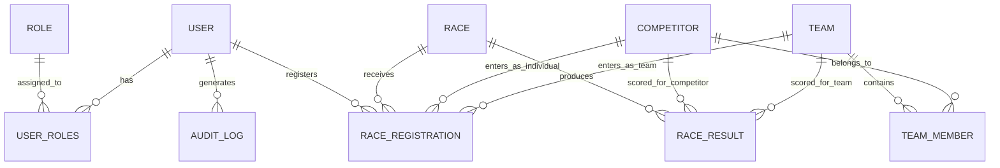

# Plan de Implementación: The Great EIA Camel vs. Dwarf Racing System

Sistema integral de información para la liga ficticia de carreras de Camellos contra Enanos de la Universidad EIA. Incluye backend REST en Java 21 / Spring Boot 3, base de datos relacional PostgreSQL en Docker, interfaz web responsiva en React + Vite con diseño premium (UI/UX Pro Max), autenticación JWT basada en roles, suite de pruebas automatizadas y despliegue orquestado con Docker Compose.

---

## 1 · Arquitectura

### En una frase
Sistema web y API REST empresarial para la gestión, registro, control de carreras absurdas y cálculo de clasificaciones entre camellos y enanos, con control de acceso por roles, persistencia en PostgreSQL y ejecución dockerizada en un solo comando.

### Stack Tecnológico
- **Lenguaje / Runtime:** Java 21 (LTS) & Node.js 20+ (LTS).
- **Framework Backend:** Spring Boot 3.3+ (Spring Web, Spring Data JPA, Spring Security 6, Spring Validation).
- **Base de Datos:** PostgreSQL 16 (en contenedor Docker con volumen persistente nombrado `postgres_data`). H2 exclusivamente en perfil `test`.
- **Frontend:** React 18 / Vite 5, JavaScript/TypeScript, CSS Vanilla estructurado con Design Tokens (UI/UX Pro Max), Lucide React para iconografía SVG.
- **Seguridad:** Spring Security con JWT (jjwt 0.12+) y hashing BCrypt.
- **Testing:** JUnit 5, Mockito, Spring Boot Test (`MockMvc`), AssertJ.
- **Contenedores:** Docker & Docker Compose (`compose.yml`) con redes aisladas y variables de entorno seguras.

### Mapa de Carpetas

```text
Trabajo_Rest_API/
├── compose.yml                          # Orquestación de backend, frontend y db
├── .env.example                         # Plantilla de variables de entorno (sin secretos)
├── .gitignore                           # Exclusiones de Git
├── README.md                            # Documentación técnica completa
├── PLAN_DE_IMPLEMENTACION.md            # Este plan de implementación persistente
│
├── backend/                             # Backend Java Spring Boot
│   ├── pom.xml                          # Dependencias Maven (o build.gradle)
│   ├── Dockerfile                       # Multi-stage build (JDK 21 Temurin)
│   ├── src/
│   │   ├── main/
│   │   │   ├── java/com/eia/racing/
│   │   │   │   ├── config/              # CORS, SecurityConfig, DataInitializer
│   │   │   │   ├── controller/          # Endpoints REST (sin lógica de negocio)
│   │   │   │   ├── dto/
│   │   │   │   │   ├── request/         # Request payloads (@Valid)
│   │   │   │   │   └── response/        # Response payloads (ocultan entidades JPA)
│   │   │   │   ├── entity/              # Entidades JPA (@Entity, @Table)
│   │   │   │   ├── enums/               # CompetitorType, RaceStatus, RoleName, etc.
│   │   │   │   ├── exception/           # Custom exceptions + @RestControllerAdvice
│   │   │   │   ├── repository/          # Interfaces Spring Data JPA
│   │   │   │   ├── security/            # JwtFilter, JwtTokenProvider, CustomUserDetails
│   │   │   │   └── service/             # Lógica de negocio y reglas de dominio
│   │   │   └── resources/
│   │   │       ├── application.yml      # Configuración de base de datos y JWT
│   │   │       └── data.sql (opcional)  # Seeds iniciales (o vía DataInitializer.java)
│   │   └── test/
│   │       ├── java/com/eia/racing/     # 15+ tests automatizados (unitarios y de integración)
│   │       └── resources/
│   │           └── application-test.yml # Configuración H2 en memoria para tests
│
└── frontend/                            # Cliente Web SPA
    ├── package.json
    ├── vite.config.js
    ├── Dockerfile                       # Multi-stage build (Node build -> Nginx Alpine)
    ├── nginx.conf                       # Configuración de proxy inverso y fallback SPA
    ├── index.html
    └── src/
        ├── assets/                      # SVGs, banners e ilustraciones temáticas
        ├── components/                  # UI reutilizable: Navbar, Modal, Table, Badge, Toast
        ├── context/                     # AuthContext (token, usuario, permisos)
        ├── hooks/                       # useAuth, useFetch, useNotification
        ├── pages/                       # Login, Dashboard, Competitors, Teams, Races, etc.
        ├── services/                    # api.js (Axios / Fetch con interceptor Bearer)
        ├── styles/                      # variables.css (tokens UI/UX Pro Max), main.css
        └── utils/                       # Formateadores de fecha, tiempo y validadores
```

### Flujo de Datos
1. **Cliente HTTP:** El navegador realiza una petición HTTP (`GET`, `POST`, `PUT`, `PATCH`, `DELETE`) hacia `/api/...`.
2. **Filtro de Seguridad:** `JwtAuthenticationFilter` extrae el token del header `Authorization: Bearer <jwt>`, valida firma y vigencia, y carga `Authentication` en el `SecurityContextHolder`.
3. **Controlador:** El `@RestController` recibe la petición, valida los `@Valid DTOs` y delega la ejecución al `@Service`.
4. **Capa de Servicio:** Aplica todas las reglas de negocio (ej. estados de carrera, unicidad de alias, elegibilidad, topes de cupos, cálculo de puntos), genera auditoría con `AuditService` y coordina con `Repository`.
5. **Persistencia:** Spring Data JPA interactúa con PostgreSQL mediante transacciones `@Transactional`.
6. **Respuesta:** El servicio mapea la entidad a un `ResponseDTO` y el controlador retorna el código de estado HTTP estándar (`200`, `201`, `204`, etc.). Si ocurre un error, el `GlobalExceptionHandler` captura la excepción y retorna un JSON uniforme con código `400`, `401`, `403`, `404` o `409`.

### Lo que NO existe (y no hay que crear)
- No hay servicios de caché distribuida en memoria (Redis/Memcached) obligatorios (solo se implementa si sobra tiempo como bonus opcional).
- No hay GraphQL ni WebSockets obligatorios (la API es puramente REST JSON estándar).
- No se expone ninguna entidad JPA directamente al frontend.
- No hay persistencia en H2 en producción (H2 es solo para tests con `@ActiveProfiles("test")`).
- No se usan librerías externas pesadas de UI (sin Bootstrap clásico anticuado ni componentes genéricos mal integrados; se usa un Design System CSS Vanilla moderno según UI/UX Pro Max).

---

## 2 · Convenciones de Código

### Estilo
- **Backend (Java):** Google Java Style Guide / Clean Code.
    - Clases: `PascalCase` (`CompetitorService`, `RaceRegistrationController`).
    - Métodos y variables: `camelCase` (`findActiveCompetitors()`, `maxParticipants`).
    - Constantes y Enums: `UPPER_SNAKE_CASE` (`OPEN_FOR_REGISTRATION`, `ROLE_ADMINISTRATOR`).
    - Paquetes: todo en minúsculas sin guiones (`com.eia.racing.controller`).
- **Frontend (JavaScript/React):**
    - Componentes y vistas: `PascalCase.jsx` (`CompetitorList.jsx`, `RaceCard.jsx`).
    - Hooks y utilidades: `camelCase.js` (`useAuth.js`, `formatTime.js`).
    - Estilos: BEM o clases semánticas estructuradas con CSS Variables (`.btn--primary`, `.badge--injured`).
- **Imports:** Orden estandarizado: 1. Librerías nativas/Java core, 2. Frameworks (Spring/React), 3. Módulos internos del proyecto. Sin imports comodín (`*`).

### Patrones que SÍ usamos
- **Separación estricta de responsabilidades:** Los controladores solo deserializan, validan DTOs y serializan respuestas. Cero lógica de negocio en controladores.
- **DTOs bidireccionales:** `CompetitorRequestDTO` para entrada y `CompetitorResponseDTO` para salida.
- **Manejo de Excepciones Centralizado:** Todas las excepciones de negocio (`ResourceNotFoundException`, `BusinessRuleException`, `InvalidStateTransitionException`) heredan de una base común y son capturadas en `GlobalExceptionHandler`.
- **Auditoría Transaccional:** Cada mutación sensible (creación, edición, cambio de estado, resultado) dispara un evento síncrono/servicio que inserta un registro en la tabla `audit_logs`.
- **Soft-Delete / Desactivación:** Las entidades con historial oficial (competidores y equipos con carreras) cambian de estado (`RETIRED`, `INACTIVE`) en lugar de eliminarse físicamente (`DELETE`).

### Patrones PROHIBIDOS
- **NUNCA exponer Entidades JPA en endpoints:** Prohibido retornar `@Entity` directamente por seguridad y evitar bucles de serialización cíclica.
- **NUNCA retornar Stack Traces:** Prohibido mostrar trazas de error de Java o SQL al cliente web. Siempre retornar el formato JSON unificado `StructuredErrorResponse`.
- **NUNCA guardar contraseñas en plano:** Todas las claves se almacenan mediante `BCryptPasswordEncoder`.
- **NUNCA quemar secretos en el código:** Variables de entorno para `JWT_SECRET`, contraseñas de BD y puertos. `.env` ignorado en `.gitignore`.
- **NUNCA usar Emojis como iconos de interfaz:** Obligatorio usar SVGs limpios (Lucide Icons) según la regla UI/UX Pro Max.

### Tests
- **Ubicación:** `backend/src/test/java/com/eia/racing/...`
- **Obligatoriedad:** Mínimo 15 pruebas unitarias y de integración que validen casos de éxito, errores de validación, transiciones de estado inválidas y denegación de permisos de seguridad.
- **Aislamiento:** Las pruebas usan perfil `test` con base H2 en memoria para que se ejecuten velozmente de forma independiente sin depender de Docker levantado.

### Commits
- Formato **Conventional Commits**:
    - `feat: add competitor registration with validation rules`
    - `fix: prevent duplicate start position assignment in race registrations`
    - `test: add unit test for race creation in the past rejection`
    - `refactor: extract scoring logic into domain service`
    - `docs: update readme with docker compose instructions`
- Ramas requeridas: `main`, `develop`, `feature/security`, `feature/competitors`, `feature/teams`, `feature/races`, `feature/registrations`, `feature/results`, `feature/frontend`.

---

## 3 · Decisiones Tomadas

### 2026-09-08 · Arquitectura Desacoplada Backend Java + Frontend React SPA
- **Decisión:** Separar el proyecto en una API REST pura con Spring Boot 3 y un frontend SPA con React + Vite.
- **Por qué:** Permite cumplir con el requerimiento de probar los endpoints de forma totalmente independiente a la interfaz gráfica, facilita la contenedorización en dos imágenes livianas y garantiza una experiencia de usuario fluida sin recargas completas de página.
- **Descartado:** Thymeleaf monolítico (descartado para evitar acoplamiento de vistas y facilitar diseño moderno con UI/UX Pro Max) y Swing/JavaFX (descartado por complejidad de empaquetado en contenedor web y visual anticuado).
- **Estado:** Vigente.

### 2026-09-08 · Base de Datos PostgreSQL 16 con Docker Volume Persistente
- **Decisión:** PostgreSQL como motor de base de datos relacional para el entorno de producción/docker.
- **Por qué:** Soporta de manera robusta restricciones de clave foránea, índices únicos compuestos, integridad referencial y tipos enum, cumpliendo rigurosamente la prohibición de usar H2 como base de datos persistente final.
- **Descartado:** MongoDB (descartado porque el dominio es altamente relacional: carreras, participantes, equipos, registros y clasificaciones) y MySQL (PostgreSQL ofrece mejor soporte de restricciones y funciones analíticas de ranking).
- **Estado:** Vigente.

### 2026-09-08 · Autenticación JWT Stateless con 3 Roles Semánticos
- **Decisión:** Implementar autenticación basada en tokens JWT con Spring Security 6 y los tres roles requeridos: `Administrator`, `Race Organizer`, `Viewer`.
- **Por qué:** Stateless, fácil de consumir desde la SPA de React y Postman, escalable en contenedores y permite control fino con anotaciones `@PreAuthorize("hasRole('ADMIN')")`.
- **Descartado:** Auth0 / Cognito en la nube (descartado para asegurar que el proyecto corra 100% offline y de forma autónoma con `docker compose up -d` sin requerir conexión a internet ni cuentas de pago).
- **Estado:** Vigente.

### 2026-09-08 · Sistema de Diseño UI/UX Pro Max "Vibrant Racing"
- **Decisión:** Aplicar el sistema de diseño "Hero-Centric / Vibrant & Block-based" con tipografía Google Fonts (Bebas Neue para titulares y Source Sans 3 / Inter para cuerpo), paleta de alto contraste con tonos rojos de competición (`#DC2626`), oro de trofeo (`#F59E0B`), fondos oscuros y claros con contraste superior a 4.5:1, e iconografía SVG pura mediante Lucide.
- **Por qué:** Supera con creces el requerimiento del instructor ("el sistema debe parecer un producto coherente, no siete páginas HTML ensambladas cinco minutos antes") y cumple con la regla obligatoria `user_global`.
- **Descartado:** Diseños planos genéricos o librerías de componentes sin identidad propia.
- **Estado:** Vigente.

---

## 4 · Glosario y Entidades

### Términos del Dominio
- **Camello:** Competidor cuadrúpedo cuya velocidad es impredecible y que comienza la carrera cuando se siente emocionalmente preparado. No puede registrarse como enano.
- **Enano:** Competidor bípedo que compite individualmente o en equipos (por ejemplo, "The Five Exceptions"), haciendo uso de trabajo en equipo y discursos motivacionales.
- **Medio (Medium):** Competidor de tamaño intermedio aprobado para competir en la liga.
- **Carrera Mixta (MIXED):** Competición donde pueden participar tanto individuos (camellos/enanos sueltos) como equipos completos.
- **Inscripción (Registration):** Solicitud formal de participación en una carrera. Debe ser aprobada por el organizador y tener asignado un carril/posición de salida único.
- **Puntaje Oficial:** Escala oficial de la liga: 1º lugar = 10 pts, 2º lugar = 7 pts, 3º lugar = 5 pts, 4º lugar = 3 pts, 5º lugar = 1 pt, DNF/DQ = 0 pts.

### Entidades Principales



1. **User (`users`):**
    - Campos: `id` (UUID/Long), `username` (unique), `email` (unique), `password` (hash BCrypt), `fullName`, `enabled`, `createdAt`.
    - Relaciones: Muchos a muchos con `Role`.
2. **Role (`roles`):**
    - Campos: `id`, `name` (`ROLE_ADMINISTRATOR`, `ROLE_ORGANIZER`, `ROLE_VIEWER`).
3. **Competitor (`competitors`):**
    - Campos: `id`, `name`, `nickname` (unique), `type` (`DWARF`, `CAMEL`, `MEDIUM`, `OTHER`), `birthDate`, `weight` (>0), `height` (>0), `country`, `status` (`ACTIVE`, `INJURED`, `SUSPENDED`, `RETIRED`), `victories`, `defeats`, `completedRaces`, `createdAt`.
4. **Team (`teams`):**
    - Campos: `id`, `name` (unique), `description`, `coach`, `status` (`ACTIVE`, `INACTIVE`, `SUSPENDED`), `maxMembers` (int, default 5), `victories`, `defeats`, `createdAt`.
5. **TeamMember (`team_members`):**
    - Campos: `id`, `team_id`, `competitor_id`, `joinedAt`, `active`.
    - Restricción: Un competidor no puede pertenecer a más de un equipo activo simultáneamente.
6. **Race (`races`):**
    - Campos: `id`, `name`, `description`, `scheduledDateTime`, `startLocation`, `finishLocation`, `distanceMeters` (>0), `maxParticipants`, `raceType` (`INDIVIDUAL`, `TEAM`, `MIXED`), `raceStatus` (`DRAFT`, `OPEN_FOR_REGISTRATION`, `CLOSED_FOR_REGISTRATION`, `IN_PROGRESS`, `COMPLETED`, `CANCELLED`), `organizer_id`, `registrationDeadline`, `createdAt`, `updatedAt`.
7. **RaceRegistration (`race_registrations`):**
    - Campos: `id`, `race_id`, `competitor_id` (nullable), `team_id` (nullable), `registrationDate`, `status` (`PENDING`, `APPROVED`, `REJECTED`, `CANCELLED`), `assignedLane`, `validationNotes`, `created_by_user_id`.
8. **RaceResult (`race_results`):**
    - Campos: `id`, `race_id`, `competitor_id` (nullable), `team_id` (nullable), `startPosition`, `finalPosition`, `completionTimeSeconds` (BigDecimal/Double), `penaltyTimeSeconds`, `status` (`FINISHED`, `DISQUALIFIED`, `DID_NOT_FINISH`, `DID_NOT_START`), `pointsAwarded`, `notes`, `recorded_by_user_id`, `recordedAt`.
9. **AuditLog (`audit_logs`):**
    - Campos: `id`, `username`, `action`, `entityType`, `entityId`, `timestamp`, `description`, `previousValue` (JSON/TEXT), `newValue` (JSON/TEXT).

---

## 5 · Flujo de Trabajo

### Antes de tocar nada
1. Verificar que Docker esté ejecutándose (`docker info`).
2. Clonar o inicializar el repositorio Git con la rama base `main` y crear `develop`.
3. Revisar este archivo `PLAN_DE_IMPLEMENTACION.md` para tener claras las reglas de negocio y restricciones del inciso a trabajar.
4. Crear la rama de feature correspondiente (ej: `git checkout -b feature/competitors develop`).

### Para hacer un cambio
1. **Definir contrato / DTOs:** Crear o actualizar los DTOs de entrada y salida con sus validaciones `@NotNull`, `@NotBlank`, `@Positive`, etc.
2. **Escribir el Test (TDD / Test-First):** Escribir la prueba unitaria o de controlador en JUnit 5 reflejando el caso exitoso y los casos de error.
3. **Implementar en Capas:**
    - Crear entidad JPA y repositorio.
    - Implementar lógica en la capa `@Service` asegurando lanzar excepciones controladas ante violaciones de regla.
    - Exponer endpoint en `@RestController` retornando los códigos HTTP correctos (`201`, `204`, `200`, etc.).
    - Registrar la acción en `AuditLog`.
4. **Verificar Pruebas:** Ejecutar `./mvnw test` (o `mvn test`) y validar que pasen sin errores.
5. **Implementar en Frontend:** Conectar el servicio en la SPA de React con manejo de estados `loading`, `success`, `empty` y `error`.

### Antes de dar algo por terminado
- [ ] Todas las pruebas de backend pasan en verde (`./mvnw test`).
- [ ] El frontend compila sin errores de sintaxis o bundle (`npm run build`).
- [ ] No quedan llamadas a `console.log` huérfanas ni `System.out.println`.
- [ ] Los endpoints no devuelven stack traces bajo ningún parámetro inválido.
- [ ] Las acciones protegidas por roles responden `401 Unauthorized` o `403 Forbidden` según corresponda.
- [ ] El commit sigue la convención Conventional Commits y se integra a `develop` mediante Pull Request / Merge limpio.

### Despliegue Local
Se realiza mediante un único comando desde la raíz del proyecto:
```bash
docker compose up --build -d
```
- Backend disponible en: `http://localhost:8080`
- Frontend disponible en: `http://localhost:3000` (o `http://localhost:5173`)
- Base de datos PostgreSQL disponible en el puerto `5432`

---

## 6 · Errores Conocidos (Gotchas)

### 1. "El camello cree que es un enano"
- **Pasa cuando:** Se intenta crear o registrar un competidor de tipo `CAMEL` en una categoría o equipo exclusivo de enanos o asignándole tipo `DWARF`.
- **Causa real:** El payload incluye `type: "DWARF"` con nombre o características incompatibles o la regla explícita del enunciado se viola.
- **Solución:** Validación en `CompetitorService`: lanzar `BusinessRuleException("A camel must not be registered as a dwarf, even if it strongly believes in itself")` con código HTTP `400 Bad Request`.

### 2. "Dos ganadores o tres segundos puestos"
- **Pasa cuando:** Al registrar resultados de una carrera, el operador ingresa `finalPosition: 1` para más de un participante.
- **Causa real:** Falta de restricción de unicidad para la posición final entre finalistas (`FINISHED`).
- **Solución:** Validar en `RaceResultService` que en una misma carrera no exista más de un competidor con `finalPosition == 1` y que las posiciones de los finalistas normales sean estrictamente consecutivas y únicas. Responder `409 Conflict` o `400 Bad Request`.

### 3. "La carrera completada vuelve mágicamente a DRAFT"
- **Pasa cuando:** Se intenta editar o actualizar el estado de una carrera ya finalizada (`COMPLETED`).
- **Causa real:** No proteger la máquina de estados de `RaceStatus`.
- **Solución:** Matriz de transición de estados estricta en `RaceService`: `COMPLETED` es un estado terminal. Cualquier intento de modificarla lanza `InvalidStateTransitionException("A completed race cannot magically return to DRAFT, even if the camel requests a rematch")`.

### 4. "PostgreSQL no persiste tras reiniciar contenedores"
- **Pasa cuando:** Se ejecuta `docker compose down -v` o no se especificó un volumen nombrado.
- **Causa real:** Pérdida de datos si no hay un named volume montado en `/var/lib/postgresql/data`.
- **Solución:** Declarar explícitamente en `compose.yml` el volumen:
  ```yaml
  volumes:
    postgres_data:
      driver: local
  ```
  Y advertir en el README que nunca se debe usar `-v` salvo que se desee resetear la base de datos intencionalmente.

### 5. "Error de CORS en el navegador al invocar la API desde React"
- **Pasa cuando:** La SPA hace un `fetch` o petición Axios a `http://localhost:8080/api/...` y la consola muestra `blocked by CORS policy`.
- **Causa real:** Falta de configuración de `CorsConfigurationSource` en Spring Security.
- **Solución:** Clase `CorsConfig` que permita `allowedOrigins("http://localhost:3000", "http://localhost:5173")`, headers `*` y métodos `GET, POST, PUT, PATCH, DELETE, OPTIONS`.

### 6. Cosas que parecen rotas pero son a propósito
- **Un competidor con resultados no se puede borrar:** Si se ejecuta `DELETE /api/competitors/{id}`, la API responde `409 Conflict` (o realiza un retiro/desactivación a `RETIRED` con `200 OK`) porque las reglas prohíben la eliminación física de participantes con historial oficial.
- **La vista oculta los botones de creación al usuario Viewer:** El usuario `Viewer` solo puede consultar datos públicos; la desaparición de los botones "Crear Carrera" o "Editar" no es un error de renderizado, sino el cumplimiento de la protección de interfaz por roles.

---

## 7 · Desglose Detallado Inciso por Inciso (Módulos del Proyecto)

### Módulo 1 — Autenticación y Seguridad
- **Roles y Permisos:**
    - `Administrator`: Acceso total (usuarios, competidores, equipos, carreras, inscripciones, resultados y auditoría completa).
    - `Race Organizer`: Gestión de carreras, inscripciones y resultados; visualización de competidores y equipos.
    - `Viewer`: Solo lectura de información pública, calendarios, resultados y tablas de clasificación.
- **Contratos de API:**
    - `POST /api/auth/register` (Crea usuario con rol por defecto `VIEWER` o según autorización admin).
    - `POST /api/auth/login` (Recibe `{username, password}`, valida hash BCrypt y retorna `{token, type: "Bearer", username, role}`).
    - `GET /api/auth/profile` (Retorna el perfil del usuario autenticado a partir del token).
- **Seguridad en Backend:**
    - `SecurityFilterChain` sin estado (`SessionCreationPolicy.STATELESS`).
    - Endpoints públicos: `/api/auth/**`, `GET /api/standings/**`, `GET /api/races/**` (solo lectura de carreras abiertas/completadas).
    - Endpoints protegidos: Todas las mutaciones (`POST`, `PUT`, `PATCH`, `DELETE`) requieren token válido y roles autorizados.

### Módulo 2 — Gestión de Competidores
- **Tipos (`CompetitorType`):** `DWARF`, `CAMEL`, `MEDIUM`, `OTHER`.
- **Estados (`CompetitorStatus`):** `ACTIVE`, `INJURED`, `SUSPENDED`, `RETIRED`.
- **Reglas de Negocio:**
    - `name`: Obligatorio, no vacío (`@NotBlank`).
    - `nickname`: Obligatorio, único en el sistema (`@Column(unique = true)`).
    - `weight` y `height`: Numéricos estrictamente positivos (`@Positive`).
    - Solo competidores `ACTIVE` pueden ser inscritos en nuevas carreras.
    - Prohibido registrar un camello como enano.
    - Paginación obligatoria: `page`, `size`, `sort`.
    - Filtros: Por tipo (`type`), estado (`status`) y búsqueda por nombre/apodo.
    - Eliminación segura: Si tiene carreras registradas, retornar error `409 Conflict` o desactivar a `RETIRED`.

### Módulo 3 — Gestión de Equipos
- **Reglas de Negocio:**
    - Nombre único y descripción obligatoria.
    - Entrenador / responsable registrado.
    - Capacidad máxima configurable (`maxMembers`, por defecto 5).
    - Un competidor **NO puede pertenecer a más de un equipo activo simultáneamente**.
    - Un competidor no puede añadirse duplicado al mismo equipo.
    - Un equipo suspendido (`SUSPENDED`) no puede ingresar a una carrera.
    - Un equipo debe tener al menos un competidor para poder participar en una carrera.
    - Un equipo con historial oficial no puede eliminarse físicamente (debe pasar a `INACTIVE`).
- **Endpoints:**
    - `POST /api/teams`, `GET /api/teams`, `GET /api/teams/{id}`, `PUT /api/teams/{id}`, `DELETE /api/teams/{id}`.
    - `POST /api/teams/{teamId}/members/{competitorId}` (agrega miembro).
    - `DELETE /api/teams/{teamId}/members/{competitorId}` (remueve miembro).

### Módulo 4 — Gestión de Carreras
- **Tipos de Carrera (`RaceType`):** `INDIVIDUAL`, `TEAM`, `MIXED`.
- **Estados (`RaceStatus`):**
    - `DRAFT` (Borrador inicial)
    - `OPEN_FOR_REGISTRATION` (Abierta para inscripciones)
    - `CLOSED_FOR_REGISTRATION` (Cierre de inscripciones para armar grilla)
    - `IN_PROGRESS` (En carrera, lista para registrar tiempos)
    - `COMPLETED` (Finalizada, resultados publicados y oficiales)
    - `CANCELLED` (Cancelada por organizador/admin)
- **Reglas de Negocio:**
    - Distancia > 0 metros.
    - No se puede crear con fecha en el pasado (`@Future`).
    - La fecha límite de inscripción (`registrationDeadline`) debe ser anterior a la fecha de inicio (`scheduledDateTime`).
    - No se pueden recibir inscripciones en una carrera cancelada o fuera de su fecha límite.
    - Mínimo **2 participantes válidos** para poder iniciar la carrera (`IN_PROGRESS`).
    - No puede pasarse a `COMPLETED` si no se han registrado los resultados oficiales.
    - Una carrera `COMPLETED` no puede modificarse ni volver a `DRAFT`.

### Módulo 5 — Registro e Inscripciones a Carreras
- **Estados de Inscripción (`RegistrationStatus`):** `PENDING`, `APPROVED`, `REJECTED`, `CANCELLED`.
- **Reglas de Negocio:**
    - Solo se permiten inscripciones cuando el estado es `OPEN_FOR_REGISTRATION` y antes del `registrationDeadline`.
    - Un competidor o equipo no puede inscribirse dos veces en la misma carrera (validación de duplicidad).
    - Los competidores individuales y los integrantes de los equipos deben estar en estado `ACTIVE` (no lesionados ni suspendidos).
    - Un competidor no puede participar simultáneamente como individual y como miembro de un equipo en la misma carrera.
    - El tipo de participante debe concordar con el `RaceType`:
        - En `INDIVIDUAL`, solo se aceptan competidores individuales.
        - En `TEAM`, solo se aceptan equipos.
        - En `MIXED`, se permiten ambos.
    - No se pueden duplicar los carriles o posiciones de salida asignadas (`assignedLane`).
    - Rechazos obligan a incluir una nota de motivo (`validationNotes`).
- **Endpoints:**
    - `POST /api/races/{raceId}/registrations`
    - `GET /api/races/{raceId}/registrations`
    - `PATCH /api/registrations/{id}/approve`
    - `PATCH /api/registrations/{id}/reject`

### Módulo 6 — Resultados y Clasificaciones (Standings)
- **Estados de Resultado (`ResultStatus`):** `FINISHED`, `DISQUALIFIED`, `DID_NOT_FINISH`, `DID_NOT_START`.
- **Sistema de Puntos Oficial:**
  | Posición Final | Puntos Otorgados |
  | :--- | :--- |
  | 1º Lugar (Ganador) | 10 pts |
  | 2º Lugar | 7 pts |
  | 3º Lugar | 5 pts |
  | 4º Lugar | 3 pts |
  | 5º Lugar | 1 pt |
  | DNF / Disqualified / DNS | 0 pts |
- **Reglas de Negocio:**
    - Solo se pueden registrar resultados en carreras que estén en estado `IN_PROGRESS`.
    - Solo los participantes en estado `APPROVED` pueden recibir resultados.
    - El tiempo de llegada (`completionTimeSeconds`) debe ser estrictamente positivo para quienes finalicen (`FINISHED`).
    - Solo puede existir **un único ganador oficial** (posición 1).
    - Un participante descalificado (`DISQUALIFIED`) no puede ganar ni obtener puntos.
    - Posiciones finales únicas entre los que terminaron normalmente.
    - El registro o actualización de un resultado recalcula y actualiza de manera consistente las victorias, derrotas y puntos acumulados de los competidores y equipos involucrados.
- **Endpoints:**
    - `POST /api/races/{raceId}/results`
    - `GET /api/races/{raceId}/results`
    - `PUT /api/results/{id}`
    - `GET /api/standings/competitors` (Tabla general de clasificación de competidores)
    - `GET /api/standings/teams` (Tabla general de clasificación de equipos)

### Módulo 7 — Interfaz Gráfica de Usuario (GUI Web)
Cumpliendo con los estándares visuales de **UI/UX Pro Max**:
- **Pantallas Obligatorias:**
    1. **Login:** Formulario estilizado con validaciones en vivo y mensajes claros de error.
    2. **Dashboard:** Indicadores clave (total carreras, competidores activos, victorias de camellos vs enanos), carrusel de próximas carreras y últimos podios.
    3. **Lista de Competidores:** Tarjetas y tabla con filtrado reactivo por tipo y estado, búsqueda por apodo y paginación visual.
    4. **Formulario de Competidor:** Modal o pantalla dedicada con control de campos numéricos (peso/altura) y feedback inmediato.
    5. **Gestión de Equipos:** Vista detallada de equipos con gestión interactiva de miembros (añadir/remover enanos o camellos).
    6. **Lista y Detalle de Carreras:** Filtro por estado (`OPEN_FOR_REGISTRATION`, `COMPLETED`), indicador visual de tiempo restante para inscripciones.
    7. **Formulario de Carrera:** Selector de fecha/hora con bloqueo de fechas pasadas y cálculo de fechas límites.
    8. **Gestión de Inscripciones:** Bandeja de aprobación/rechazo de inscripciones con modal para ingresar motivo de rechazo.
    9. **Registro de Resultados:** Formulario para registrar tiempos, penalizaciones y posiciones finales con validación en tiempo real (evita duplicar puestos).
    10. **Leaderboard / Standings:** Podio visual con medallas de oro, plata y bronce, y tabla completa de posiciones y puntos.
    11. **Perfil de Usuario:** Datos de sesión, rol activo y botón de cierre de sesión seguro.
    12. **Pantallas 403 y 404:** Páginas ilustradas y temáticas ("Acceso denegado: El camello no tiene los permisos requeridos").
- **Comportamiento Requerido:**
    - Botones y opciones de menú ocultos o deshabilitados si el rol no tiene permisos.
    - Almacenamiento seguro de token en `localStorage` o `sessionStorage`.
    - Diálogos de confirmación para acciones destructivas (ej. cancelar carrera, dar de baja competidor).
    - Estados claros de carga (skeletons), éxito (toasts verdes), listas vacías (empty states ilustrados) y error (toasts rojos informativos).

### Módulo 8 — Registro de Auditoría (Audit Log)
- Registro automático de: Inicio de sesión (`LOGIN`), creación de usuarios, cambios de competidores, cancelaciones de carreras, decisiones de inscripción (`APPROVED`/`REJECTED`) y registro/edición de resultados.
- Datos: `id`, `user`, `action`, `entityType`, `entityId`, `date`, `description`, `previousValue`, `newValue`.
- Solo accesible por el rol `Administrator` mediante `GET /api/audit-logs`.

---

## 8 · Especificación del Formato de Respuestas de Error REST

Todas las respuestas de error de la API seguirán estrictamente el formato especificado en la página 10 del requerimiento:

```json
{
  "timestamp": "2026-08-15T14:30:00",
  "status": 404,
  "error": "Not Found",
  "message": "Competitor with ID 45 was not found",
  "path": "/api/competitors/45"
}
```

Códigos de Estado HTTP utilizados:
- `200 OK`: Consulta o actualización exitosa.
- `201 Created`: Recurso creado exitosamente (retornado en creación de competidores, equipos, carreras, inscripciones, etc.).
- `204 No Content`: Eliminación o desactivación exitosa sin cuerpo de respuesta.
- `400 Bad Request`: Parámetros inválidos, validaciones de Bean Validation fallidas (`@Positive`, `@NotBlank`), violaciones lógicas (ej. camello registrado como enano).
- `401 Unauthorized`: Token JWT ausente, expirado o malformado.
- `403 Forbidden`: Usuario autenticado con rol insuficiente (ej. Viewer intentando crear una carrera).
- `404 Not Found`: Recurso no encontrado por su identificador.
- `409 Conflict`: Conflictos de negocio (apodo duplicado, competidor que ya pertenece a otro equipo activo, dos ganadores en una carrera, o intento de borrar una entidad con historial oficial).

---

## 9 · Plan de Pruebas Automatizadas (Mínimo 15 Tests Obligatorios)

Las siguientes pruebas se implementarán en JUnit 5 utilizando `MockMvc` o pruebas de integración con base de datos en memoria H2:

| # | Nombre de la Prueba | Capa / Clase de Test | Comportamiento Esperado |
| :--- | :--- | :--- | :--- |
| **1** | `testCreateValidCompetitor` | `CompetitorControllerTest` | Retorna `201 Created` y el DTO con ID asignado al enviar datos válidos. |
| **2** | `testRejectCompetitorWithInvalidWeight` | `CompetitorValidationTest` | Retorna `400 Bad Request` cuando el peso es `<=` 0. |
| **3** | `testRejectDuplicatedNickname` | `CompetitorServiceTest` | Lanza excepción y retorna `409 Conflict` si el apodo ya existe en BD. |
| **4** | `testCreateValidRace` | `RaceControllerTest` | Retorna `201 Created` para una carrera con distancia > 0 y fecha futura. |
| **5** | `testRejectRaceScheduledInThePast` | `RaceValidationTest` | Retorna `400 Bad Request` al enviar una fecha en el pasado (`@Future`). |
| **6** | `testRegisterActiveCompetitorSuccessfully` | `RaceRegistrationTest` | Retorna `201 Created` al inscribir un competidor activo dentro del plazo. |
| **7** | `testRejectSuspendedCompetitor` | `RaceRegistrationTest` | Retorna `400 Bad Request` al intentar inscribir un competidor `SUSPENDED`. |
| **8** | `testRejectDuplicatedRegistration` | `RaceRegistrationTest` | Retorna `409 Conflict` si el competidor ya está inscrito en la carrera. |
| **9** | `testRejectRegistrationAfterDeadline` | `RaceRegistrationTest` | Retorna `400 Bad Request` si la fecha de inscripción supera el deadline. |
| **10** | `testRecordValidResult` | `RaceResultTest` | Retorna `201 Created` y actualiza victorias/puntos al registrar tiempos válidos. |
| **11** | `testRejectTwoWinnersInOneRace` | `RaceResultTest` | Retorna `400/409` si se intenta registrar una segunda posición 1 en la carrera. |
| **12** | `testPreventViewerFromCreatingRace` | `SecurityAuthorizationTest` | Retorna `403 Forbidden` cuando un usuario con rol `VIEWER` hace `POST /api/races`. |
| **13** | `testAllowAdministratorToCreateRace`| `SecurityAuthorizationTest` | Retorna `201 Created` cuando un usuario con rol `ADMINISTRATOR` hace `POST /api/races`.|
| **14** | `testReturn401WithoutValidToken` | `SecurityAuthenticationTest` | Retorna `401 Unauthorized` al invocar endpoints protegidos sin header Bearer. |
| **15** | `testReturn404ForMissingResource` | `GlobalExceptionHandlingTest` | Retorna `404 Not Found` en formato JSON estructurado para un ID inexistente. |
| **16** | *Bonus:* `testCamelCannotBeRegisteredAsDwarf` | `CompetitorBusinessRuleTest` | Retorna `400 Bad Request` con mensaje humorístico y regla de negocio validada. |
| **17** | *Bonus:* `testCompletedRaceCannotReturnToDraft`| `RaceStateMachineTest` | Retorna `400 Bad Request` al intentar cambiar el estado de `COMPLETED` a `DRAFT`. |
| **18** | `testCreateValidTeam` | `TeamTests` | Retorna `201 Created` con `memberCount` en 0 al crear un equipo válido. |
| **19** | `testRejectDuplicatedTeamName` | `TeamTests` | Retorna `409 Conflict` si el nombre del equipo ya existe. |
| **20** | `testCompetitorCannotBelongToTwoActiveTeams` | `TeamTests` | Retorna `400 Bad Request` al añadir a un competidor que ya milita en otro equipo activo. |
| **21** | `testRejectDuplicatedTeamMember` | `TeamTests` | Retorna `409 Conflict` al añadir dos veces al mismo competidor al mismo equipo. |
| **22** | `testRejectMemberOverTeamCapacity` | `TeamTests` | Retorna `400 Bad Request` al superar el tope `maxMembers` del equipo. |
| **23** | `testRemoveMemberFreesTeamSlot` | `TeamTests` | Retorna `204 No Content` al remover un miembro y permite ocupar el cupo liberado. |

> **Implementación real:** las 23 pruebas viven en 6 clases (`CompetitorTests`, `TeamTests`, `RaceTests`, `RegistrationTests`, `ResultTests`, `SecurityAndExceptionTests`), agrupadas por módulo de negocio en lugar de una clase por prueba.

---

## 10 · Datos Iniciales Semilla (Database Seeding)

Al iniciar la aplicación por primera vez en un entorno nuevo, `DataInitializer.java` (o script SQL) cargará automáticamente:

1. **Usuarios y Roles:**
    - Administrador: `admin` / `Admin123!` (Rol: `ROLE_ADMINISTRATOR`)
    - Organizador: `organizer` / `Organizer123!` (Rol: `ROLE_ORGANIZER`)
    - Espectador: `viewer` / `Viewer123!` (Rol: `ROLE_VIEWER`)
2. **Competidores (9 en total):**
    - **5 Enanos:** `Null Pointer`, `Stack Overflow`, `Little Lambda`, `Captain Cache`, `Tiny Docker`.
    - **2 Camellos:** `Byte`, `Kernel`.
    - **2 Medianos:** `Garbage Collector`, `Bitwise Operator`.
3. **Equipos (2 en total):**
    - Equipo 1: `The Five Exceptions` (Contiene a los 5 enanos).
    - Equipo 2: `The Desert Threads` (Equipo alternativo de corredores).
4. **Carreras (3 en total):**
    - Carrera 1 (`COMPLETED`): "Gran Premio de Zúñiga 1979" (1000m, con resultados oficiales registrados y podio asignado).
    - Carrera 2 (`IN_PROGRESS`): "Clásico Alto de Las Palmas" (1500m, lista para registrar tiempos).
    - Carrera 3 (`OPEN_FOR_REGISTRATION`): "Derby Tecnológico EIA" (2000m, abierta a inscripciones).

---

## 11 · Configuración de Docker y Contenedores

El archivo `compose.yml` en la raíz del proyecto levantará los 3 servicios interconectados en una red bridge privada:

```yaml
services:
  db:
    image: postgres:16-alpine
    container_name: eia_racing_db
    environment:
      POSTGRES_DB: ${DB_NAME:-racing_db}
      POSTGRES_USER: ${DB_USERNAME:-racing_user}
      POSTGRES_PASSWORD: ${DB_PASSWORD:-racing_pass123}
    ports:
      - "5432:5432"
    volumes:
      - postgres_data:/var/lib/postgresql/data
    networks:
      - racing-network
    healthcheck:
      test: ["CMD-SHELL", "pg_isready -U ${DB_USERNAME:-racing_user} -d ${DB_NAME:-racing_db}"]
      interval: 5s
      timeout: 5s
      retries: 5

  backend:
    build:
      context: ./backend
      dockerfile: Dockerfile
    container_name: eia_racing_backend
    environment:
      DB_HOST: db
      DB_PORT: 5432
      DB_NAME: ${DB_NAME:-racing_db}
      DB_USERNAME: ${DB_USERNAME:-racing_user}
      DB_PASSWORD: ${DB_PASSWORD:-racing_pass123}
      JWT_SECRET: ${JWT_SECRET:-SuperSecretRacingKeyForJwtGenerationDoNotShare12345}
      JWT_EXPIRATION: ${JWT_EXPIRATION:-86400000}
    ports:
      - "8080:8080"
    depends_on:
      db:
        condition: service_healthy
    networks:
      - racing-network

  frontend:
    build:
      context: ./frontend
      dockerfile: Dockerfile
    container_name: eia_racing_frontend
    environment:
      API_BASE_URL: ${API_BASE_URL:-http://localhost:8080/api}
    ports:
      - "3000:80"
    depends_on:
      - backend
    networks:
      - racing-network

volumes:
  postgres_data:
    name: eia_racing_postgres_data

networks:
  racing-network:
    name: eia_racing_network
```

---

## 12 · Guión Oficial de Demostración (Video 8 a 12 Minutos)

Para asegurar la calificación perfecta (100%) según los criterios de la página 14 y 16 del documento:

1. **Apertura y Arquitectura (1 min):**
    - Mostrar `docker compose ps` con los 3 contenedores activos y saludables (`db`, `backend`, `frontend`).
    - Breve presentación de los integrantes y mapa de la solución.
2. **Ejecución de Pruebas Automatizadas (1.5 min):**
    - Ejecutar en terminal `./mvnw test` demostrando la ejecución y éxito de los 15+ tests automatizados.
3. **Autenticación y Roles (1.5 min):**
    - Iniciar sesión como `admin` en la interfaz gráfica.
    - Demostrar menú completo y vista de Auditoría disponible solo para el administrador.
4. **Creación de Competidores y Equipos (2 min):**
    - El admin crea el camello llamado `Byte`.
    - Crea los 5 enanos: `Null Pointer`, `Stack Overflow`, `Little Lambda`, `Captain Cache` y `Tiny Docker`.
    - Crea el equipo `The Five Exceptions` y le asocia los 5 enanos.
5. **Creación de Carrera e Inscripción (1.5 min):**
    - Iniciar sesión como `organizer`.
    - Crear una carrera mixta de 1000m ("Gran Desafío EIA").
    - Inscribir a `Byte` y a `The Five Exceptions`.
    - Aprobar ambas inscripciones asignándoles carriles 1 y 2.
6. **Demostración de Restricciones y Errores Controlados (1.5 min):**
    - Iniciar sesión como `viewer` e intentar modificar la carrera o crear un competidor: mostrar alerta o pantalla de **Acceso Denegado (403)**.
    - Demostrar un error de negocio controlado: intentar registrar un peso negativo o inscribir dos veces al mismo participante (mostrar mensaje amigable sin stack trace).
7. **Inicio de Carrera, Resultados y Podio (2 min):**
    - El organizador cambia el estado de la carrera a `IN_PROGRESS`.
    - Se registran los resultados oficiales con tiempos y penalizaciones.
    - Se consulta la pantalla de **Standings / Leaderboard**, mostrando la tabla actualizada con el podio y los puntos asignados.
8. **Auditoría y Cierre (1 min):**
    - El administrador entra a la pantalla de **Audit Log** y muestra el registro histórico de todas las acciones realizadas durante la demo.

---

## 13 · Plan de Ejecución por Fases (Roadmap)

### Fase 1: Entorno, Repositorio y Estructura Base
- Configuración de Git, ramas base (`main`, `develop`) y archivo `.gitignore`.
- Generación del esqueleto Spring Boot con dependencias en `backend/`.
- Verificación del runtime Java/JDK local (mediante winget / Temurin 21 o Maven Wrapper).
- Creación de `.env.example` y base de `compose.yml`.

### Fase 2: Modelo de Datos, Repositorios y Seguridad JWT
- Creación de entidades JPA y enumeraciones completas.
- Configuración de Spring Security 6, filtros JWT y encoders BCrypt.
- `DataInitializer` con usuarios semilla (`admin`, `organizer`, `viewer`) y catálogo inicial.
- Endpoints de autenticación (`/api/auth/**`) y pruebas de seguridad (#12, #13, #14).

### Fase 3: Módulos de Negocio Core (Backend)
- Módulo 2: Competidores (CRUD, soft-delete, paginación, filtros, validaciones, pruebas #1, #2, #3, #16).
- Módulo 3: Equipos (CRUD, asignación de miembros, restricción de equipo único, pruebas de equipo).
- Módulo 4: Carreras (Máquina de estados, distancias, fechas futuras, pruebas #4, #5, #17).
- Módulo 5: Inscripciones (Validación de estado, deadline, participantes únicos, pruebas #6, #7, #8, #9).
- Módulo 6: Resultados y Clasificaciones (Puntajes 10-7-5-3-1, ganador único, actualización de estadísticas, pruebas #10, #11).
- Módulo 8: Auditoría (`AuditLog` y eventos automáticos).
- Manejador global de excepciones (`GlobalExceptionHandler`, prueba #15).

### Fase 4: Frontend SPA (React + Vite + UI/UX Pro Max)
- Inicialización del proyecto React con Vite en `frontend/`.
- Implementación de Design Tokens y estilos globales (paleta racing, Bebas Neue + Inter/Source Sans 3, Lucide Icons).
- Servicio API con Axios y almacenamiento de sesión JWT.
- Construcción de vistas: Login, Dashboard con métricas, Competidores, Equipos, Carreras, Inscripciones, Registro de Resultados, Standings y Auditoría.
- Protección de rutas y adaptación de botones según rol.

### Fase 5: Dockerización y Empaquetado
- Creación de `backend/Dockerfile` multi-stage.
- Creación de `frontend/Dockerfile` multi-stage con Nginx.
- Ajuste final de `compose.yml` y prueba de levantamiento integral con `docker compose up --build -d`.

### Fase 6: Documentación y Entrega
- Elaboración del `README.md` exhaustivo con los 14 puntos obligatorios de la guía.
- Colección de Postman / Insomnia exportada en JSON para pruebas manuales directas de los endpoints.
- Checklist de validación contra los 16 criterios de evaluación de la rúbrica.

---

## Preguntas Abiertas / Decisiones para el Usuario

> [!NOTE]
> Ambas preguntas abiertas quedaron resueltas durante la ejecución del plan. No hay decisiones pendientes.
>
> 1. **Gestor de Dependencias del Backend:** resuelto — se usa **Maven** (`pom.xml` con `mvnw` / `mvnw.cmd`). El wrapper está configurado con `distributionType=only-script`, por lo que descarga Maven 3.9.9 automáticamente y no requiere versionar el `maven-wrapper.jar`.
> 2. **Instalación de JDK 21 Local:** resuelto — el entorno cuenta con **Temurin JDK 21** y Maven 3.9.9 disponibles en el PATH, de modo que `mvn test` corre localmente sin depender de Docker. La suite de pruebas usa H2 en memoria con el perfil `test`.

---

## 15 · Estado de Cierre del Plan

Verificado sobre el repositorio (fecha de cierre: 2026-09-09):

| Fase | Estado | Evidencia |
| :--- | :--- | :--- |
| Fase 1 · Entorno y estructura base | Completa | `compose.yml`, `.env.example`, `.gitignore`, esqueleto Maven. |
| Fase 2 · Modelo de datos y seguridad JWT | Completa | 9 entidades JPA, `SecurityConfig` stateless, `DataInitializer` con semillas. |
| Fase 3 · Módulos de negocio backend | Completa | 9 controladores, 9 servicios, `GlobalExceptionHandler`, auditoría transaccional. |
| Fase 4 · Frontend SPA | Completa | 12 vistas incluidas Perfil, 403 y 404; `hooks/`, `utils/`, skeletons y menú móvil. |
| Fase 5 · Dockerización | Completa | Dockerfiles multi-stage, Nginx con proxy inverso `/api`, healthchecks de `db` y `backend`. |
| Fase 6 · Documentación y entrega | Completa | `README.md` con paso a paso de activación; colección Postman de 51 peticiones. |

**Suite de pruebas:** 23 pruebas automatizadas en 6 clases, todas en verde (`mvn test` → `BUILD SUCCESS`).